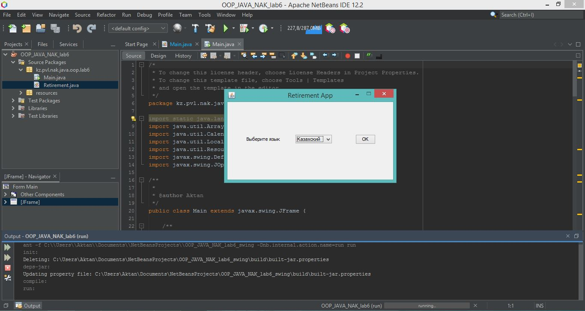
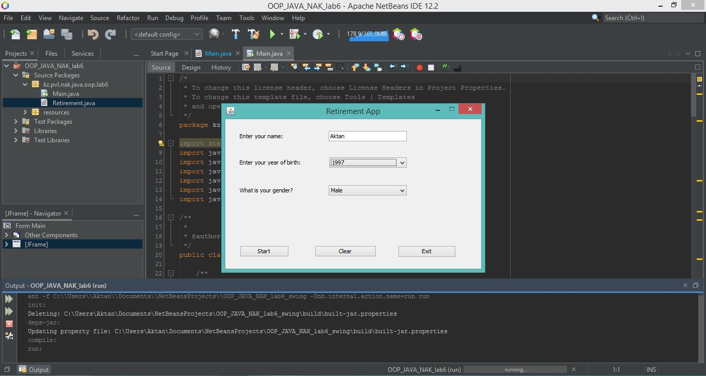

## Lab work #6 JAVA_OOP
---
__Задание:__ _Сделать графическую программу, взаимодействующая с пользователем,
на дополнительных языках. В программе предумотреть 3 вопроса и 3 ответа для 
всех языков._

---

__Screenshots:__

_Скриншот 1: Первое окно_

_Скриншот 2: Второе окно_